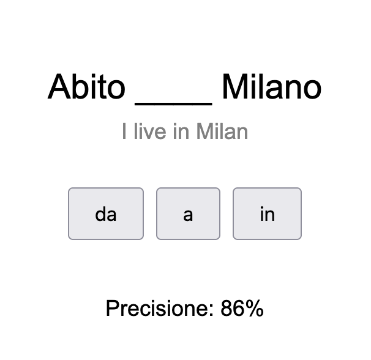

# Pratica delle Preposizioni
Practice Italian "Preposizioni" quickly in the browser using A/B/C type game.

  

To play simply visit: https://drozdowsky.github.io/pratica-preposizioni/

Feel free to open Pull Request to add/fix stuff.

<pre>              ,
     __  _.-"` `'-.
    /||\'._ __{}_(
    ||||  |'--.__\
    |  L.(   ^_\^
    \ .-' |   _ |
    | |   )\___/
    |  \-'`:._]
jgs \__/;      '-.
</pre>
